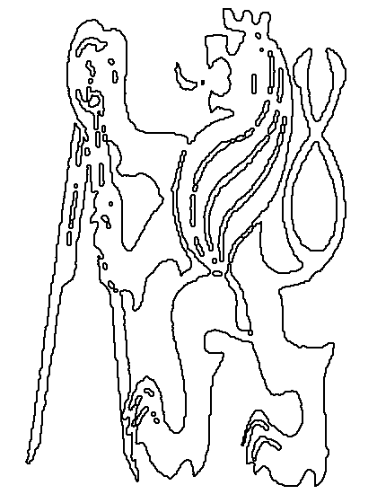

# DIPLabs

### Introduction

* This is my implementation of the labs in our Digital Image Processing Course.

### File Structure

* assets: sample pictures, input and output of my labs
* out: executable files of by labs
* src: source code

### How to Compile and Run

1. Git clone to your local device
2. Ensure you have already installed gcc, g++ and cmake
3. Navigate into DIPLabs directory
4. `cmake -S . -B ./build` to init cmake directories
5. `cd ./build; cmake --build` to build this project
6. `make` to generate all executable files
7. `cd DIPLabs/out` and you can run the demo you want

### lab1

#### Requirement

1. Load and Save Bitmap without use library
2. Convert each pixel from rgb to yuv
3. Change bitmap into 8 bit grayscale and save
4. Change the value of Y channel of each pixel and save

#### Result

|             original image              |                grayscale image                |                 channel Y changed                 |
|:---------------------------------------:|:---------------------------------------------:|:-------------------------------------------------:|
|  |  |  |

### lab2

#### Requirement

1. Implement the conversion of grayscale image to binary image
2. Implement the Morphological operation 'erosion'
3. Implement the Morphological operation 'dilation'
4. Implement the Morphological operation 'open'
5. Implement the Morphological operation 'close'

#### Result

* Morphological Operations

|              original image               |                   after erosion                   |                   after dilation                   |                   after open                   |                   after close                   |
|:-----------------------------------------:|:-------------------------------------------------:|:--------------------------------------------------:|:----------------------------------------------:|:-----------------------------------------------:|
|  |  |  |  |  |

* Border Detection

|               original image               |                   detect border                    |
|:------------------------------------------:|:--------------------------------------------------:|
|  |  |
